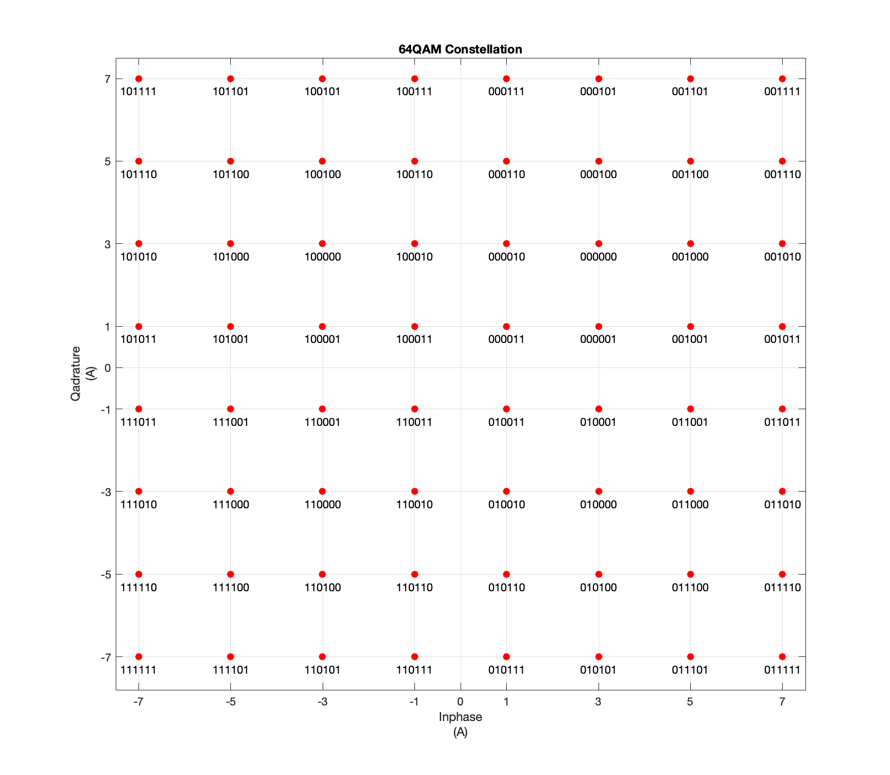
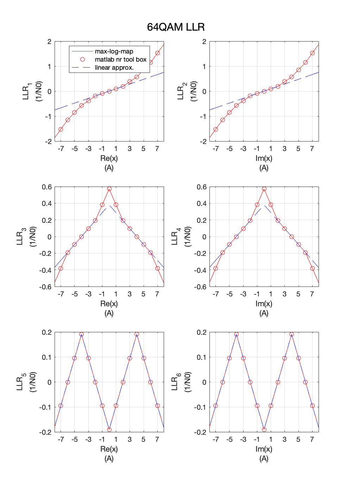

# 5G-NR-Modulation-Demodulation
The implementation of 5G NR Modulation and Demodulation
### Modulation
`symbOut = nrModuMapper(bitsIn,moduType)` maps the bit sequence into 
complex modulation symbols using modulation scheme specified in TS 38.211 Section 5.1
The modulation scheme, moduType must be one of  'BPSK', 'QPSK', '16QAM', '64QAM', '256QAM'.


### Demodulation
  `softBits = nrSoftModuDemapper(symbsIn,moduType,N0,method)` demodulates the complex symbols
  symbsIn using soft decision. The modulation scheme, moduType must be one
  of  'BPSK', 'QPSK', '16QAM', '64QAM', '256QAM'. symbsIn must be
  a column vector.
  'mothod'   -   Specified as 'max-log-map' or 'approx'.

  Demodulation is performed according to the constellations given in
  TS 38.211 section 5.1 including the power normalization factors
  specified. The factors: 1/sqrt(2) for BPSK, and QPSK,
  1/sqrt(10) for 16QAM, 1/sqrt(42) for 64QAM and 1/sqrt(170) for 256QAM.

  Source Paper: Mao, Juquan, et al. "A low complexity 256QAM soft demapper for 5G mobile system." 
  2016 European Conference on Networks and Communications (EuCNC). IEEE, 2016.
  
  Author Dr J Mao
  
  Email: juquan.justin.mao@gmail.com
  
  2021 Nov
 ``` matlab
  Example:
  %Demonstrate 16-QAM  demodulation.
  msg = randi([0 1],100,1,'int8');
  symb = nrModuMapper(msg,'16QAM');
  N0 = 0.1;
  rxsymb = symb + sqrt(N0/2)*randn(size(symb)) ;
  msg_hat = nrSoftModuDemapper(msg_hat,'16QAM',N0,'max-log-map');
  numErr = sum(msg ~=(msg_hat < 0));
  ```
  
  
   
